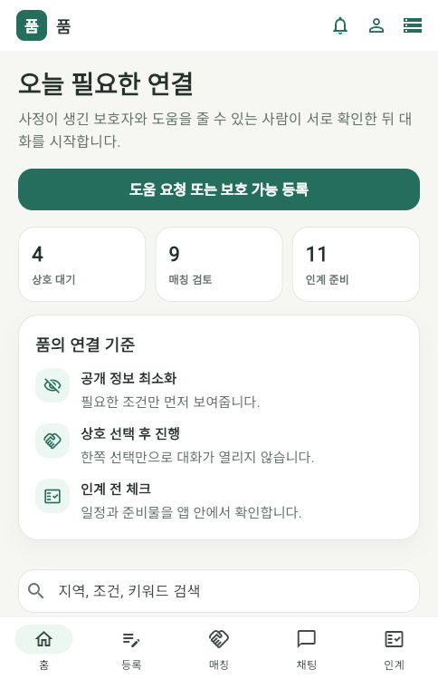
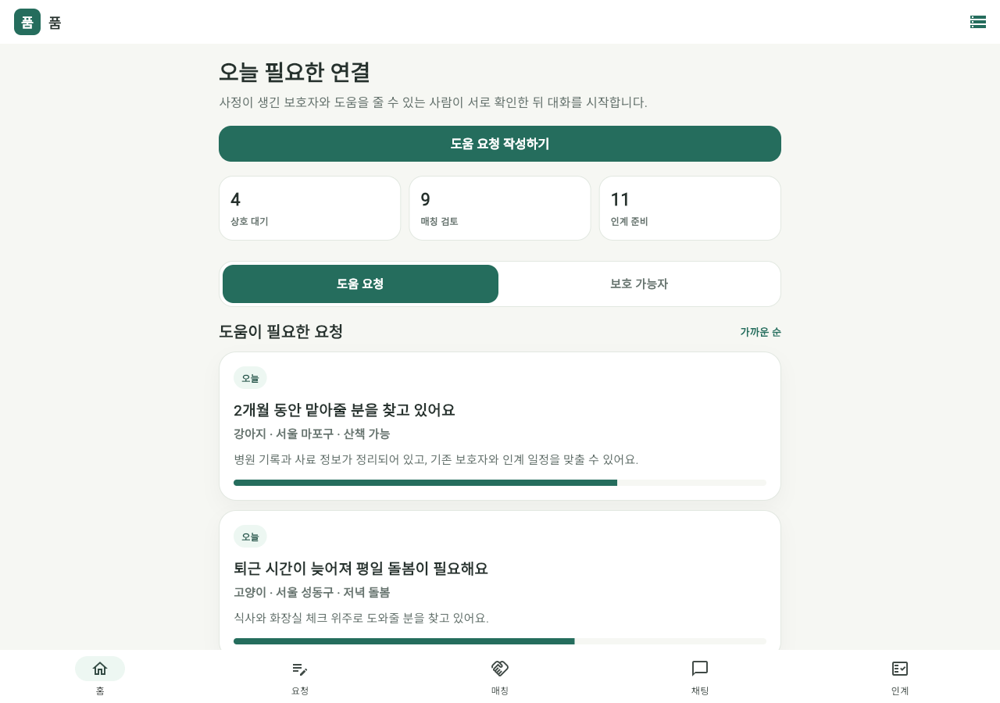
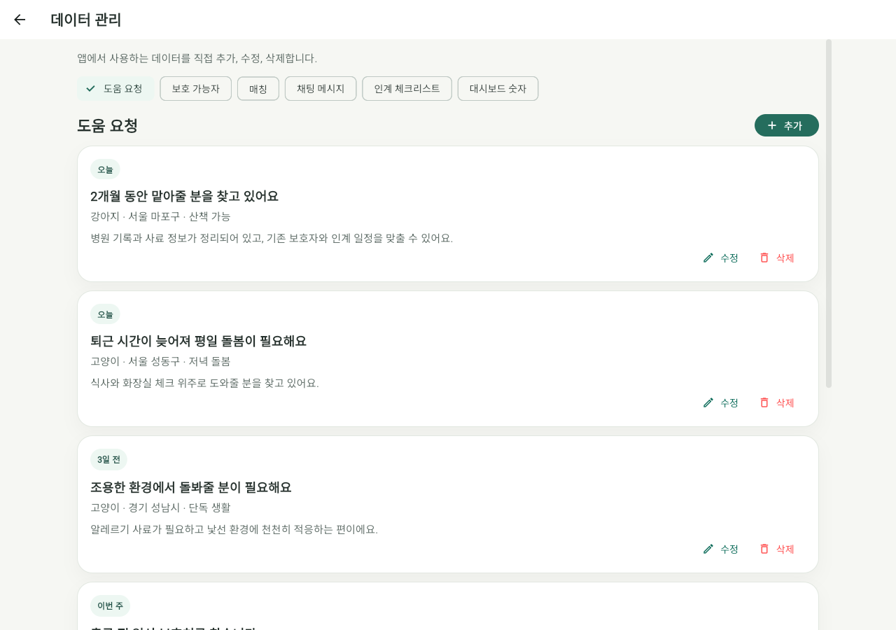
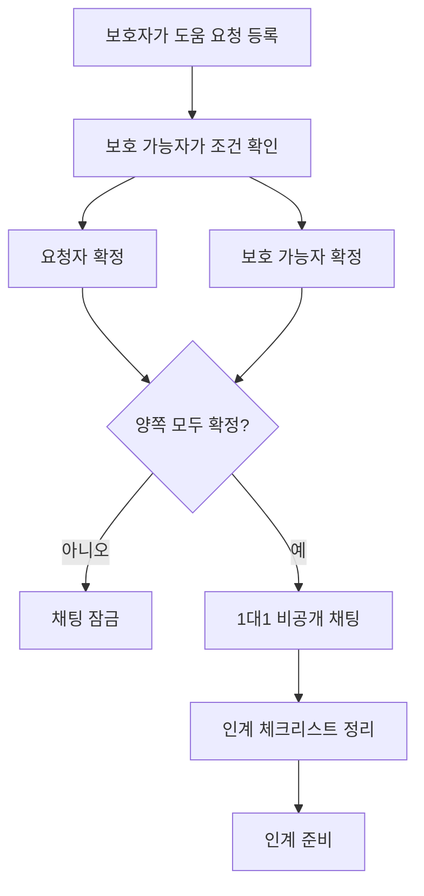
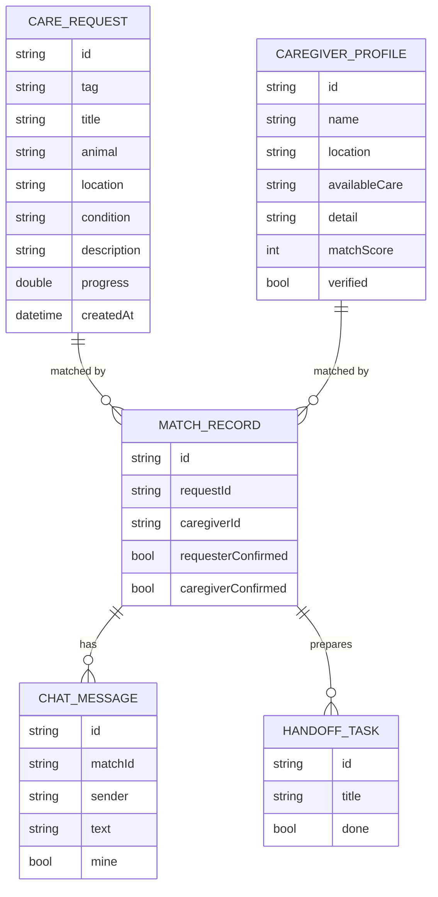
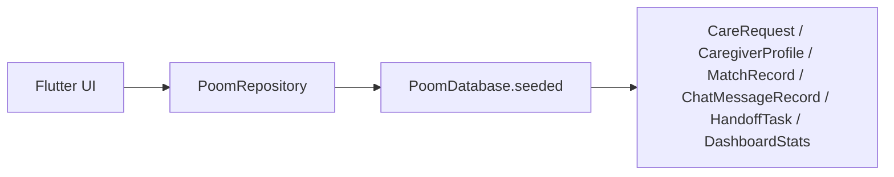

# 품 : 평생의 반려(伴侶)

`poom_app`은 사정이 생긴 반려동물 보호자와 도움을 줄 수 있는 사람을 안전하게 연결하기 위한 Flutter 앱 프로토타입입니다.

품은 유기를 막기 위한 마지막 연결 지점을 앱으로 설계합니다. 보호자가 더 이상 반려동물을 돌보기 어려운 상황에 놓였을 때, 바로 공개 채팅이나 감정적인 사진 노출로 이어지지 않고, 필요한 정보와 조건을 중심으로 도움 요청과 보호 가능자를 연결합니다.

현재 버전은 앱 화면, 반응형 UI, 임시 데이터베이스, Repository 기반 CRUD, 프론트 관리 화면까지 포함한 시안입니다.

## 화면 미리보기

| 모바일 홈 | 데스크톱 홈 |
| --- | --- |
|  |  |

| 데이터 관리 화면 |
| --- |
|  |

## 핵심 방향

- 반려동물 사진을 사용하지 않는 담백한 UI
- 보호자와 보호 가능자의 조건 중심 매칭
- 양쪽이 모두 확정한 뒤 열리는 1대1 채팅
- 채팅 이후 인계 체크리스트로 필요한 정보 정리
- 실제 백엔드로 확장하기 쉬운 Repository 구조
- 모바일과 웹 화면을 함께 고려한 반응형 레이아웃

## 주요 기능

### 1. 홈 피드

홈 화면은 피드형 구조입니다. `도움 요청`과 `보호 가능자`를 같은 영역에서 전환해 볼 수 있습니다.

- 도움이 필요한 요청 목록
- 보호 가능자 목록
- 가까운 순, 적합도 순 기준 표시
- 대시보드 숫자 표시
- 모바일/데스크톱 반응형 지원

### 2. 도움 요청

보호자가 필요한 도움을 간단히 정리할 수 있는 화면입니다.

- 동물 구분
- 도움 유형
- 지역
- 필요 기간
- 꼭 필요한 조건
- 민감 정보 비공개 안내

### 3. 1대1 매칭

운영자가 매칭을 확정하는 방식이 아니라, 요청자와 보호 가능자가 서로 확정해야 다음 단계로 넘어갑니다.

- 요청자 확정
- 보호 가능자 확정
- 양쪽 확정 시 채팅방 오픈
- 한쪽만 확정한 경우 채팅 잠금

### 4. 채팅

채팅은 모든 사용자에게 공개되지 않습니다. 1대1 매칭이 상호 확정된 뒤에만 열리는 비공개 대화 공간입니다.

- 매칭 전 채팅 잠금 화면
- 매칭 후 1대1 채팅 메시지 표시
- 인계 일정과 필요한 정보 조율

### 5. 인계 체크리스트

채팅 이후 실제 인계에 필요한 정보를 빠뜨리지 않도록 체크리스트로 정리합니다.

- 건강 기록과 병원 정보
- 식사량과 사료 종류
- 산책, 배변, 생활 습관
- 비상 연락처와 인계 장소

### 6. 데이터 관리 화면

상단 오른쪽의 데이터 관리 아이콘을 누르면 앱 내부 데이터를 직접 관리할 수 있습니다.

현재 프론트에서 CRUD 가능한 항목은 다음과 같습니다.

- 도움 요청
- 보호 가능자
- 매칭
- 채팅 메시지
- 인계 체크리스트
- 대시보드 숫자

데이터 관리 화면은 가로 스크롤 탭과 세로 스크롤을 지원합니다. 웹 화면에서도 너무 넓게 퍼지지 않도록 최대 폭을 제한했습니다.

## 앱 흐름



## 데이터 구조

현재 데이터는 `lib/data/poom_database.dart`에 임시 메모리 데이터베이스로 구성되어 있습니다. 실제 서버나 Firebase, Supabase로 옮길 때는 Repository 내부 구현만 교체하는 방향을 의도했습니다.



## 프론트와 데이터 계층

앱 화면은 직접 리스트를 들고 있지 않고 `PoomRepository`를 통해 데이터를 가져옵니다.



이 구조 덕분에 다음 단계에서 실제 백엔드를 붙일 때 화면 코드를 크게 바꾸지 않고 Repository만 교체할 수 있습니다.

## CRUD 지원 범위

| 데이터 | 생성 | 조회 | 수정 | 삭제 |
| --- | --- | --- | --- | --- |
| 도움 요청 | 지원 | 지원 | 지원 | 지원 |
| 보호 가능자 | 지원 | 지원 | 지원 | 지원 |
| 매칭 | 지원 | 지원 | 지원 | 지원 |
| 채팅 메시지 | 지원 | 지원 | 지원 | 지원 |
| 인계 체크리스트 | 지원 | 지원 | 지원 | 지원 |
| 대시보드 숫자 | 지원 | 지원 | 지원 | 초기화 지원 |

## 폴더 구조

```text
poom_app
├─ lib
│  ├─ main.dart
│  └─ data
│     └─ poom_database.dart
├─ test
│  ├─ widget_test.dart
│  └─ poom_repository_test.dart
├─ docs
│  └─ screenshots
│     ├─ home-mobile.png
│     ├─ home-desktop.png
│     └─ data-console-desktop.png
├─ web
├─ android
├─ ios
├─ windows
├─ macos
├─ linux
└─ pubspec.yaml
```

## 실행 방법

Flutter SDK가 설치되어 있어야 합니다.

```bash
flutter pub get
flutter run -d chrome
```

포트를 고정해서 실행하려면 다음 명령을 사용할 수 있습니다.

```bash
flutter run -d chrome --web-port 5174
```

브라우저에서 아래 주소로 접속합니다.

```text
http://127.0.0.1:5174/
```

## 빌드

웹 배포용 빌드는 다음 명령으로 생성합니다.

```bash
flutter build web
```

빌드 결과물은 `build/web` 폴더에 생성됩니다.

## 테스트

정적 분석:

```bash
dart analyze
```

테스트 실행:

```bash
flutter test
```

현재 포함된 테스트:

- 앱 인트로와 홈 화면 렌더링 테스트
- Repository CRUD 테스트
- 도움 요청 CRUD
- 보호 가능자 CRUD
- 매칭 CRUD
- 채팅 메시지 CRUD
- 인계 체크리스트 CRUD
- 대시보드 숫자 CRUD

## 현재 한계

현재 데이터는 앱 내부 메모리 기반 임시 데이터입니다.

따라서 앱을 새로 실행하면 초기 데이터로 돌아갑니다. 실제 서비스로 발전시키려면 다음 중 하나의 백엔드 저장소를 연결해야 합니다.

- Firebase Firestore
- Supabase
- REST API 서버
- GraphQL API 서버
- 자체 데이터베이스 서버

## 다음 단계 아이디어

- 사용자 인증
- 요청자/보호 가능자 역할 분리
- 실제 채팅 서버 연결
- 매칭 신청과 확정 이력 저장
- 알림 기능
- 인계 완료 기록
- 관리자 승인 또는 신고 기능
- 위치 기반 필터
- 실제 데이터베이스 연동

## 디자인 메모

품 앱은 사진 중심의 표현보다 조건과 책임을 중심으로 연결되는 경험을 목표로 합니다.

컬러는 웹 시안에서 사용한 녹색 계열을 기반으로 했고, 화면은 Toss처럼 직관적이고 담백하게 읽히도록 구성했습니다. 기능은 많지만 첫 화면에서는 필요한 정보만 보이도록 정리했습니다.
